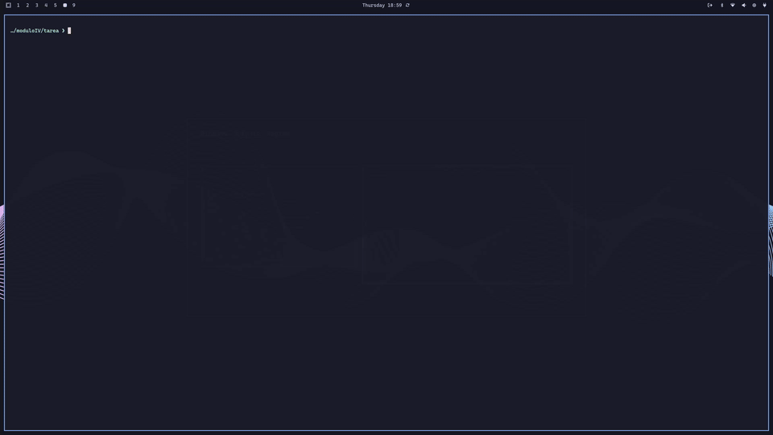

# Bases de datos NoSQL

Tarea del **Máster en Big Data & Data Engineering 2025-2026** para la asignatura de **Bases de Datos NoSQL**.

## Reto 1: Exploración inicial de los datos

- Notebook con la exploración inicial:
  - Repositorio: [**exploracion-inicial-datos.ipynb**](notebooks/exploracion-inicial-datos.ipynb)
  - 

- Todas las transformaciones realizadas sobre los ficheros se recogen en: [clean_steps.csv](https://drive.google.com/file/d/1Dk7EXdBnMTya0rs-FGtL5msnJh1gnmrJ/view?usp=drive_link).

- Ficheros transformados para cargar las colecciones en **raw_db**:
  - [licencias.csv](https://drive.google.com/file/d/1JAmIgPa7K4tNg8M2scausqLbzJYDdt1F/view?usp=drive_link)
  - [terrazas.csv](https://drive.google.com/file/d/1tM9opF8pwDhdFp7CslnlRiLFULGhONhU/view?usp=drive_link)
  - [locales.csv](https://drive.google.com/file/d/1nBXoHn16Jj5aOrlWD1RBGUacetlYidzS/view?usp=drive_link)
  - [actividades.csv](https://drive.google.com/file/d/1fwpWEaS-R-l8aRvvQXb7fSiyjzp5k-Qa/view?usp=drive_link)

- Fichero para cargar la colección con el modelo de datos embebido propuesto: [locales_mongo.json](https://drive.google.com/file/d/15pUWtq1OBkBOVvWekWUrrO_vw_QS3lh7/view?usp=drive_link).

## Reto 2: Modelado de datos

En el apartado **Modelado de datos para MongoDB** del [notebook](notebooks/exploracion-inicial-datos.ipynb), se genera el fichero [locales_mongo.json](https://drive.google.com/file/d/15pUWtq1OBkBOVvWekWUrrO_vw_QS3lh7/view?usp=drive_link). Este fichero permite cargar una colección basada en una muestra aleatoria de **25.000 locales**, utilizando el modelo de datos embebido propuesto.

Las soluciones a los ejercicios, [**mongo1.js**](mongo1.js) y [**mongo2.js**](mongo2.js), están preparadas para ejecutarse como scripts desde la consola **mongosh**, una vez cargadas la base de datos **raw_db** y sus colecciones.

## Reto 3: Modelo de grafo

En el apartado **Modelado de datos para Neo4j** del [notebook](notebooks/exploracion-inicial-datos.ipynb), se obtiene de forma aleatoria una muestra de los ficheros originales para crear la base de datos que se carga en Neo4j.

El fichero completo está disponible en: [barrios_grafo.cypher](https://drive.google.com/file/d/1CfSlpv3hFoROuVtyKoCG9-OApHuDiWoI/view?usp=drive_link).

---

[@title]: #
[Source - https://stackoverflow.com/a/35760941]: #
[Posted by Harmon, modified by community. See post 'Timeline' for change history]: #
[Retrieved 2026-02-26, License - CC BY-SA 4.0]: #

<footer style="width:100%; display:flex; justify-content:center; margin:3rem 0;">
    

      <a href="https://alejandrodecora.es/til" style="width:100%; display:flex; justify-content:center; text-decoration: none;">
          Hecho con 💜 por
          <!-- prettier-ignore -->
          <svg viewBox="0 0 600 530" version="1.1" xmlns="http://www.w3.org/2000/svg" style="position: relative; top: 4px; height: 1.25em;">
          <path
            d="m135.72 44.03c66.496 49.921 138.02 151.14 164.28 205.46 26.262-54.316 97.782-155.54 164.28-205.46 47.98-36.021 125.72-63.892 125.72 24.795 0 17.712-10.155 148.79-16.111 170.07-20.703 73.984-96.144 92.854-163.25 81.433 117.3 19.964 147.14 86.092 82.697 152.22-122.39 125.59-175.91-31.511-189.63-71.766-2.514-7.3797-3.6904-10.832-3.7077-7.8964-0.0174-2.9357-1.1937 0.51669-3.7077 7.8964-13.714 40.255-67.233 197.36-189.63 71.766-64.444-66.128-34.605-132.26 82.697-152.22-67.108 11.421-142.55-7.4491-163.25-81.433-5.9562-21.282-16.111-152.36-16.111-170.07 0-88.687 77.742-60.816 125.72-24.795z"
            fill="#1185fe" />
          </svg>
          <code>@vichelocrego</code>
      </a>
    

</footer>
