<div class="cover">
  
  <div class="cover-title">
    TAREA<br />
    BASES DE DATOS<br />
    NoSQL
  </div>
  <div class="cover-footer">
    <div><strong>Autor:</strong> Alejandro de Cora</div>
    <div>Actualizado: 02-06-2026</div>
  </div>
</div>

<div class="notas">

# Notas <!-- omit in toc -->

- El código completo del trabajo se encuentra alojado en el repositorio: [https://github.com/adecora/bbdd-nosql](https://github.com/adecora/bbdd-nosql).
- Fuentes utilizadas:
  - El material de la asignatura **Modelado de datos**.
  - [Documentación de **MongoDB**](https://www.mongodb.com/docs/development/).
  - [Documentación de **Neo4j**](https://neo4j.com/docs/).
  - Modelos de lenguaje consultados:
    - Gemini Pro Latest
    - Gemini 2.5 Pro

</div>

# Índice <!-- omit in toc -->

<div class="toc">

- [Reto 1: Exploración inicial de los datos](#reto-1-exploración-inicial-de-los-datos)
  - [Consideraciones iniciales](#consideraciones-iniciales)
  - [Revisión inicial](#revisión-inicial)
  - [Transformaciones](#transformaciones)
  - [Relaciones entre ficheros](#relaciones-entre-ficheros)
- [Reto 2: Modelado de datos](#reto-2-modelado-de-datos)
  - [Uso del modelo de datos](#uso-del-modelo-de-datos)
  - [Creación y uso de índices en MongoDB](#creación-y-uso-de-índices-en-mongodb)
- [Reto 3: Modelo de grafo](#reto-3-modelo-de-grafo)
  - [Creación de la base de datos](#creación-de-la-base-de-datos)
  - [Consultas sobre el grafo](#consultas-sobre-el-grafo)
- [Referencias y Bibliografía](#referencias-y-bibliografía)

</div>

<div class="page-break"></div>

## Reto 1: Exploración inicial de los datos

### Consideraciones iniciales

- El análisis de los ficheros se hace enteramente desde [Google colab](https://colab.research.google.com/drive/1iD43JCMTP2gLbv5MXLXZNLyL249sLDHO?usp=drive_link).
- Se han utilizado los ficheros **csv_files_raw** proporcionados en clase, estos ficheros están alojados como públicos en mi Google Drive:
  - [licencias202312.csv](https://drive.google.com/file/d/1_6E0-HROhGgJTKbjcbajEAyfvuZlcHDD/view?usp=sharing) **(FILE_ID: 1_6E0-HROhGgJTKbjcbajEAyfvuZlcHDD)**.
  - [locales202312.csv](https://drive.google.com/file/d/1WMovHctAKyjh0si6pOtYI9aq3Ki84Lxv/view?usp=sharing) **(FILE_ID: 1WMovHctAKyjh0si6pOtYI9aq3Ki84Lxv)**.
  - [terrazas202312.csv](https://drive.google.com/file/d/1pt6S7cwdpHLoXj3d0WqTlOhwdHopKik9/view?usp=sharing) **(FILE_ID: 1pt6S7cwdpHLoXj3d0WqTlOhwdHopKik9)**.
  - [actividadeconomica202312.csv](https://drive.google.com/file/d/1W7ewwd2Hdz14eo5lj57bVWInNotC9xmF/view?usp=sharing) **(FILE_ID: 1W7ewwd2Hdz14eo5lj57bVWInNotC9xmF)**.

  Esto permite acceder a los mismos a través de descarga directa [[1]](#ref1), de esta forma el cuaderno es totalmente reproducible.

- Sólo es necesario ejecutar las celdas para montar Google Drive en caso que se quiera guardar el resultado de las transformaciones sobre los ficheros y ejecutar la segunda parte del notebook:
  - El modelado de datos para MongoDB.
  - El modelado de datos para Neo4j.
  - El notebook está completamente disponible en [Google colab](https://colab.research.google.com/drive/1iD43JCMTP2gLbv5MXLXZNLyL249sLDHO?usp=drive_link).

### Revisión inicial

Antes de empezar a analizar los ficheros es importante leer la documentación asociada, donde se describen los campos de cada uno de ellos:

- **licencias:** [Contenido y estructura.](https://datos.madrid.es/dataset/200085-0-censo-locales/resource/200085-11-censo-locales)
- **terrazas:** [Contenido y estructura.](https://datos.madrid.es/dataset/200085-0-censo-locales/resource/200085-10-censo-locales)
- **locales y actividades:** [Contenido y estructura.](https://datos.madrid.es/dataset/200085-0-censo-locales/resource/200085-9-censo-locales)

De la documentación podemos extraer algunos datos interesantes:

1. No todos los nombres de los campos siguen la notación **snake_case** [[2]](#ref2).
2. Todos los ficheros comparten unos campos comunes referentes a los locales:
   - La identificación y localización del local.
   - El estado y acceso del local.
   - La dirección del edificio y el acceso real.
   - Las coordenadas y agrupaciones.
3. Varios campos tienen **valores centinela** [[3]](#ref3) para representar estados de ausencia.

#### Licencias

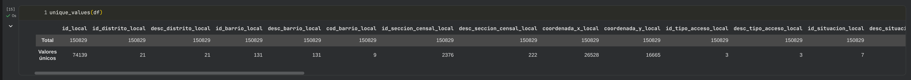

No existe un código único en el fichero de licencias: un mismo local puede tener varias licencias, o licencias en tramitación, y una misma licencia puede aplicarse a distintos locales de una misma agrupación.

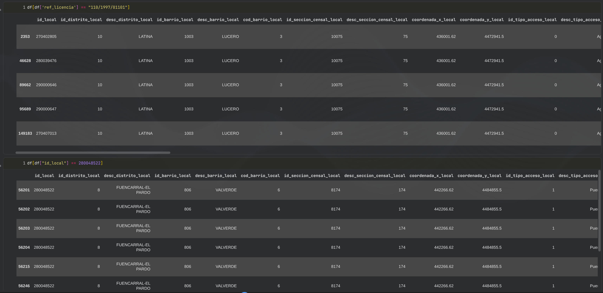

#### Terrazas

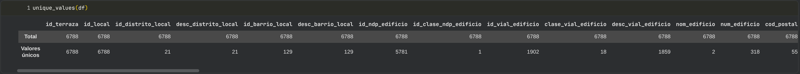

En el fichero de terrazas, `id_terraza` es único para cada terraza. Además el número de valores únicos de `id_local` coincide con el de `id_terraza`, lo que indica que cada local tiene, como máximo, una terraza asociada.

<div class="page-break"></div>

#### Locales

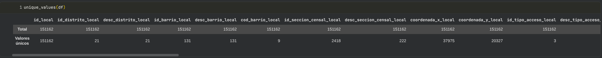

En el fichero de locales `id_local` actúa como identificador único.

#### Actividades

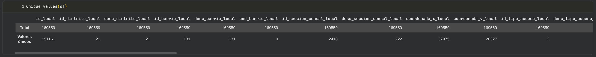

Para el fichero de actividades no existe un campo que actúe como identificador único debido a que cada local `id_local` puede ejercer diferentes actividades.


### Transformaciones

Todas las transformaciones realizadas sobre cada uno de los ficheros se han ido recogiendo bajo la estructura:

```json
{
  "dataset": "fichero afectado",
  "column": "columna afectada",
  "ejemplo_valor": "valores de ejemplo",
  "impacto": "bajo|medio|alto",
  "accion_sugerida": "descripción de la acción sugerida",
  "funcion": "funcion que transforma los datos"
}
```

El fichero [clean_steps.csv](https://drive.google.com/file/d/1Dk7EXdBnMTya0rs-FGtL5msnJh1gnmrJ/view?usp=drive_link) documenta las transformaciones aplicadas y facilita la reconstrucción de las mismas.

#### Normalizar el nombre de las columnas

La primera transformación se aplica nada más leer los ficheros con `pandas` y consiste en convertir el nombre de las columnas a **snake_case**.

#### Convertir valores centinela a nulos

Varios campos cuentan con valores centinela para expresar la ausencia de valor, algunos ya venían indicados en la documentación de los ficheros, otros no, estos son algunos ejemplos:

- `fecha_dic_lic`: 01/01/1900
- `coordenada_x/y_local/agrupacion`: 0.0
- `id_agrupacion`: -1
- `id_tipo_agrup`: -1
- `id_tipo_situacion_licencia`: -1

Para las descripciones de estos campos:

- `nombre_agrupacion`: SIN AGRUPACION
- `desc_tipo_agrup`: SIN AGRUPACION
- `desc_tipo_situacion_licencia`: VALOR NULO EN ORIGEN

Se han mantenido los valores por defecto en los campos de texto, pero se han reemplazado por `pd.NA` en los campos numéricos y espaciales.

#### Eliminar columnas

En todos los ficheros **csv_files_raw**, aparecen las columnas: `fx_carga`, `fx_datos_ini` y `fx_datos_fin` estas columnas no están informadas en la documentación, pueden ser fechas de carga o procesado de una etapa posterior, he optado por eliminarlas ya que no aportan valor a los datos.

#### Normalizar columnas de texto

Los campos de texto presentan varios problemas, pueden contener varios espacios al principio o al final de cada cadena. Esto complica las queries al intentar filtrar por un literal.

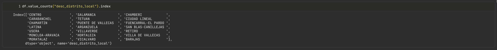

También nos podemos encontrar con categorías duplicadas a causa de diferencias de acentuación.

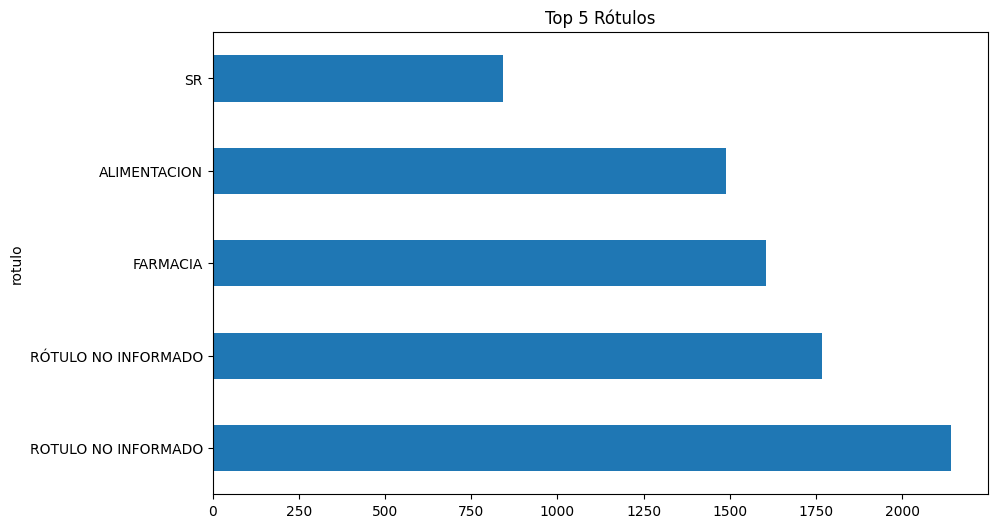

Para mejorar la consistencia, normalizamos todos los campos de texto. En el estándar Unicode, varios caracteres se pueden expresar de diversas formas. Por ejemplo, el carácter [U+00D1 (Letra N MAYÚSCULA con tilde)](https://www.compart.com/en/unicode/U+00D1) también se puede expresar con la secuencia [U+004E (Letra N MAYÚSCULA)](https://www.compart.com/en/unicode/U+004E) [U+0303 (Tilde combinable)](https://www.compart.com/en/unicode/U+0303). El carácter unicode [U+0301 representa el acento agudo combinable](https://www.compart.com/en/unicode/U+0301).

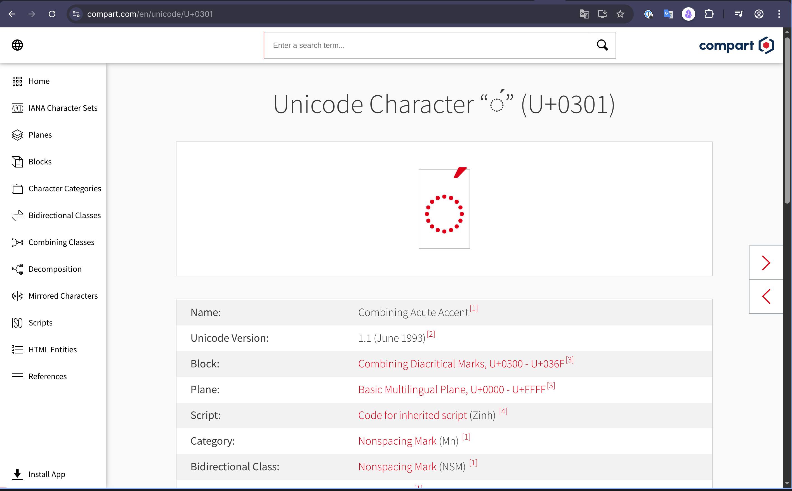

Para normalizar las cadenas de texto, se descompone con `NFD` o `NFKD` y se elimina el carácter unicode `U+0301` que representa el acento agudo combinable.

```
Formas normalizadas de Unicode[[4]](#ref4)
============================
Cadena normalizada "NFKC": 'R\xd3TULO NO INFORMADO'
Cadena normalizada "NFC": 'R\xd3TULO NO INFORMADO'
Cadena normalizada "NFKD": 'RO\u0301TULO NO INFORMADO'
Cadena normalizada "NFD": 'RO\u0301TULO NO INFORMADO'

Normalización de los acentos
============================
Cadena sin acentos: ROTULO NO INFORMADO
```

#### Convertir campos de fecha y hora

Los campos fecha que aparecen como texto se convierten a formato de fecha válido con `pd.to_datetime`.

En el caso de los horarios los valores aparecían como texto en diferentes formatos se han normalizado como `"hh:mm"` eliminando la información de segundos en los casos en que estaba informada ya que esta no era relevante. Además se crean las columnas de duración como resultado de transformar los horarios a `pd.to_timedelta` y realizar el cálculo del tiempo de apertura.

#### Normalizar coordenadas espaciales

Las coordenadas en los ficheros aparecen en formato **UTM** _(Sistema de referencia: Hasta el 15 de septiembre de 2017 ED-50, a partir de esa fecha ETRS89)_. Vamos a suponer **ETRS89** ya que los ficheros tratados son posteriores a esa fecha. Para convertir las coordenadas a longitud, latitud y visualizar la posición podemos utilizar una [calculadora geodésica.](https://www.ign.es/web/calculadora-geodesica)

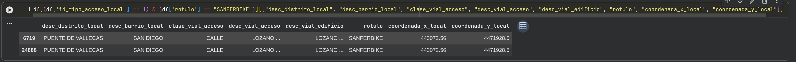

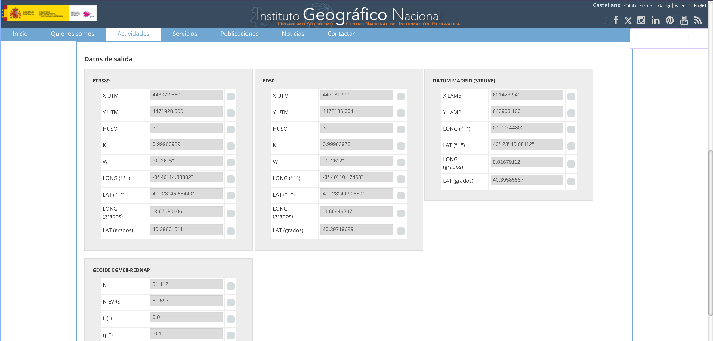

Una vez que tenemos la latitud y longitud es fácil validarlas buscándolas en Google Maps: [https://www.google.com/maps/place/40%C2%B023'45.7%22N+3%C2%B040'14.9%22W/@40.3958793,-3.6708874,20.63z/data=!4m4!3m3!8m2!3d40.3960278!4d-3.6708056?entry=ttu&g_ep=EgoyMDI2MDUyMC4wIKXMDSoASAFQAw%3D%3D](https://www.google.com/maps/place/40%C2%B023'45.7%22N+3%C2%B040'14.9%22W/@40.3958793,-3.6708874,20.63z/data=!4m4!3m3!8m2!3d40.3960278!4d-3.6708056?entry=ttu&g_ep=EgoyMDI2MDUyMC4wIKXMDSoASAFQAw%3D%3D)

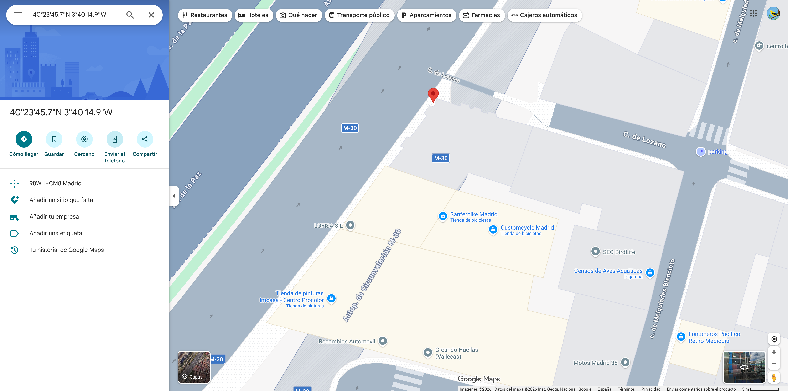

Las coordenadas en formato **UTM** no son tan útiles, se utiliza la librería [`pyproj`](https://pyproj4.github.io/pyproj/stable/) para transformar las coordenadas desde ETRS89 / UTM zona 30N (`EPSG:25830`) a longitud y latitud [[5]](#ref5). La transformación a longitud y latitud permite construir puntos GeoJSON compatibles con índices `2dsphere` en MongoDB.

<div class="page-break"></div>

### Relaciones entre ficheros

Todos los ficheros comparten `id_local`, por lo que el documento principal en MongoDB será el de local. Las terrazas se modelan como un subdocumento porque, en esta muestra, cada local tiene como máximo una terraza. Las licencias y actividades se modelan como arrays porque un local puede tener varias.

En el caso de actividades, un modelo referenciado sería más normalizado, ya que existe un catálogo finito de epígrafes. Sin embargo, se ha optado por incrustarlas para simplificar las consultas centradas en el local.

- **locales:** Documento raíz, utilizaremos `id_local` como `_id`.
- **terrazas:** Relación **uno a uno**.
- **licencias:** Relación **uno a muchos**.
- **actividades:** Relación **uno a muchos**.

El patrón propuesto es el siguiente:

```json
{
  "_id": 270415106,
  "rotulo": "CASH ECOFAMILIA",
  "location": { "type": "Point", "coordinates": [-3.664916, 40.389454] },
  "licencias": [{ "ref_licencia": "...", "fecha_dec_lic": "..." }],
  "terraza": { "id_terraza": 123, "superficie_es": 10.5 },
  "actividades": [{ "id_epigrafe": "472402", "desc_epigrafe": "..." }]
}
```

Para generar un fichero que nos permita cargar los datos con el patrón propuesto, se han muestreado de forma aleatoria **25_000** locales del fichero de locales y se extrae del resto de ficheros la información relativa a estos locales.

```
Para los 25000 locales escogidos aleatoriamente hay:
    - 1129 terrazas
    - 24875 licencias
    - 28128 actividades
```

Se eliminan las columnas de locales del resto de ficheros y se transforman, según la relación para unirlas al fichero de locales, se genera también el campo **location**, un punto GeoJSON creado a partir de las coordenadas de longitud y latitud.

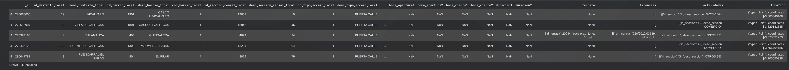

## Reto 2: Modelado de datos

Para la primera parte del reto se cargan los ficheros originales **transformados** en la base de datos **raw_db**, estos ficheros son públicos, para que se puedan reproducir los ejemplos:

- [licencias.csv](https://drive.google.com/file/d/1JAmIgPa7K4tNg8M2scausqLbzJYDdt1F/view?usp=drive_link).
- [terrazas.csv](https://drive.google.com/file/d/1tM9opF8pwDhdFp7CslnlRiLFULGhONhU/view?usp=drive_link).
- [locales.csv](https://drive.google.com/file/d/1nBXoHn16Jj5aOrlWD1RBGUacetlYidzS/view?usp=drive_link).
- [actividades.csv](https://drive.google.com/file/d/1fwpWEaS-R-l8aRvvQXb7fSiyjzp5k-Qa/view?usp=drive_link).

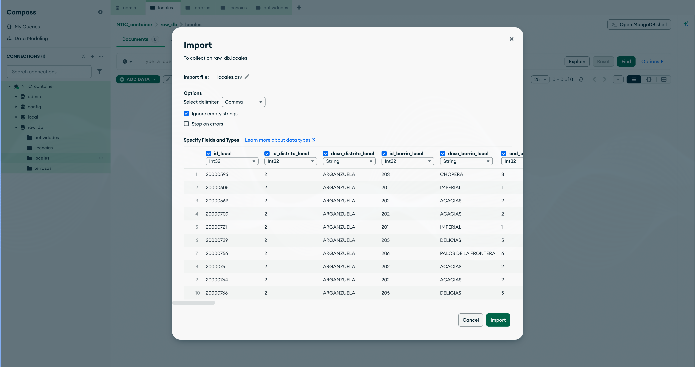

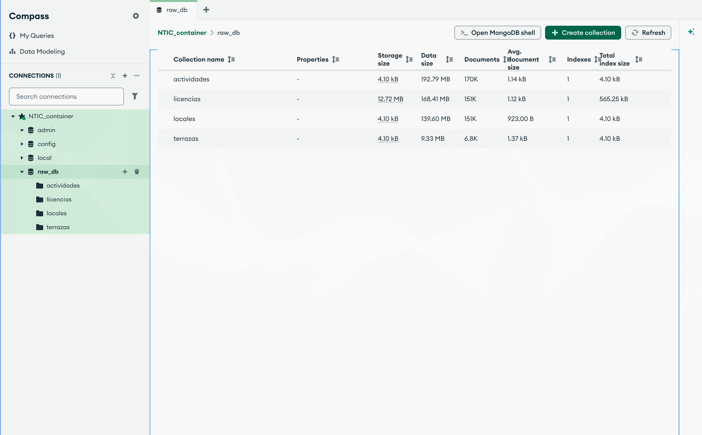

### Uso del modelo de datos

Todas las consultas se encuentran definidas en [mongo1.js](https://github.com/adecora/bbdd-nosql/blob/master/mongo1.js) y una vez que la base de datos **raw_db** está cargada [puede ejecutarse como:](https://github.com/adecora/bbdd-nosql/blob/master/ejemplo1.gif)

```bash
$ docker cp mongo1.js mongo_ntic:/tmp
$ docker exec -it mongo_ntic mongosh /tmp/mongo1.js
```

**a) Recuperar el total de locales, terrazas, licencias y actividades económicas.**

```js
use raw_db;

for (let collection of db.getCollectionNames()) {
  let count = db[collection].countDocuments();
  print(`"${collection}":`.padEnd(15), `${count.toLocaleString()}`);
}
```

<div class="page-break"></div>

**b) Identifica todos los valores distintos para los campos: "terrazas.desc_situacion_terraza", "terrazas.desc_periodo_terraza", "locales.desc_situacion_local" y "licencias.desc_tipo_licencia".**

```js
const fieldsToCheck = [
  'terrazas.desc_situacion_terraza',
  'terrazas.desc_periodo_terraza',
  'locales.desc_situacion_local',
  'licencias.desc_tipo_licencia',
];

for (let field of fieldsToCheck) {
  let [collectionName, fieldName] = field.split('.');

  print(`\nValores distintos para "${field}":`);
  db[collectionName]
    .distinct(fieldName)
    .forEach((value) => print(`- ${value}`));
  print('-'.repeat(40));
}
```

<div class="page-break"></div>

**c) Construye dos consultas donde uses los operadores lógicos $and, $or y $not.**

- _Consulta 1: Terrazas en la zona de "SAN DIEGO", excluyendo la "ALBUFERA" con la terraza abierta entre 10 y 15 horas en periodo "ANUAL"._

  ```js
  let filter = {
    desc_periodo_terraza: 'ANUAL',
    desc_barrio_local: 'SAN DIEGO',
    $and: [
      { duracion_lj_ra: { $exists: true } },
      { duracion_lj_ra: { $gte: 10 } },
      { duracion_lj_ra: { $lte: 15 } },
    ],
    desc_vial_edificio: { $not: /^ALBUFERA$/ },
  };

  let projection = {
    _id: 0,
    direccion_local: {
      $concat: ['$clase_vial_edificio', ' ', '$desc_vial_edificio'],
    },
    rotulo: 1,
    desc_situacion_terraza: 1,
    ubicacion_terraza: {
      $concat: [
        '$desc_ubicacion_terraza',
        ', EN ',
        '$desc_clase',
        ' ',
        '$desc_nombre',
      ],
    },
    superficie_es: 1,
    mesas_es: 1,
    mesas_ra: 1,
    hora_ini_lj_ra: 1,
    hora_fin_lj_ra: 1,
    duracion_lj_ra: 1,
  };

  let query = db.terrazas.countDocuments(filter);

  print(`\nTotal de terrazas que cumplen estas condiciones: ${query}`);
  print('\nTerrazas que cumplen esta condición');
  print('-'.repeat(40));
  db.terrazas.find(filter, projection).forEach(printjson);
  ```

- _Consulta 2: Top3 de actividades económicas en la zona de "SAN DIEGO" excluyendo aquellas que tengan "NULO" o "SIN ACTIVIDAD" en su descripción._

  ```js
  db.actividades
    .aggregate([
      {
        $match: {
          desc_barrio_local: 'SAN DIEGO',
          $nor: [{ desc_epigrafe: /NULO/ }, { desc_epigrafe: /SIN ACTIVIDAD/ }],
        },
      },
      {
        $group: {
          _id: '$desc_epigrafe',
          count: { $count: {} },
          locales: { $push: '$rotulo' },
        },
      },
      { $sort: { count: -1 } },
      { $limit: 3 },
    ])
    .forEach(printjson);
  ```

**d) Construye dos consultas donde uses los operadores $exists y $type juntos.**

En la colección de locales, los campos: `id_planta_agrupado`, `id_local_agrupado` `rotulo` son de tipo mixed. En el resto de ficheros los campos detectados como mixed fueron corregidos durante el **import** en Mongo Compass.

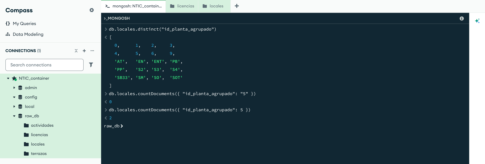

- _Consulta 1: Consultar el número de locales que tienen un valor definido para el campo `id_planta_agrupado` en función de su tipo de dato (string o number)._

  ```js
  print(`Valores distintos para el campo "id_planta_agrupado":`);
  db.locales
    .aggregate([
      {
        $group: {
          _id: { $type: '$id_planta_agrupado' },
          count: { $sum: 1 },
        },
      },
      { $sort: { count: -1 } },
      { $project: { _id: 0, tipo: '$_id', count: 1 } },
    ])
    .forEach(printjson);

  print(`Número total de locales:`.padEnd(60), db.locales.countDocuments());
  query = db.locales.countDocuments({
    id_planta_agrupado: { $exists: true, $type: 'string' },
  });
  print(
    `Número de locales con "id_planta_agrupado" de tipo string:`.padEnd(60),
    `${query}`
  );

  query = db.locales.countDocuments({
    id_planta_agrupado: { $exists: true, $type: 'number' },
  });
  print(
    `Número de locales con "id_planta_agrupado" de tipo number:`.padEnd(60),
    `${query}`
  );

  query = db.locales.countDocuments({ id_planta_agrupado: { $exists: false } });
  print(
    `Número de locales sin el campo "id_planta_agrupado":`.padEnd(60),
    `${query}`
  );
  ```

- _Consulta 2: Consultar el número de licencias de cada barrio del distrito "PUENTE DE VALLECAS" indicando la fecha mínima y máxima de concesión de licencia en cada barrio._ [[6]](#ref6)
  ```js
  db.licencias
    .aggregate([
      {
        $match: {
          desc_distrito_local: 'PUENTE DE VALLECAS',
          fecha_dec_lic: { $exists: true, $type: 'date' },
        },
      },
      { $sort: { desc_barrio_local: 1, fecha_dec_lic: 1 } },
      {
        $group: {
          _id: '$desc_barrio_local',
          licencias: { $count: {} },
          min_fecha: { $first: '$fecha_dec_lic' },
          max_fecha: { $last: '$fecha_dec_lic' },
        },
      },
      { $sort: { licencias: -1 } },
    ])
    .forEach(printjson);
  ```

**e) Encuentra locales, terrazas o licencias cuyo rotulo contenga "CAFE" o "RESTAURANTE" (insensible a mayúsculas).**

```js
// Busca únicamente los rótulos que comiencen por CAFE o por RESTAURANTE
filter = {
  rotulo: /^(CAFE|RESTAURANTE)/i,
};

for (let collection of ['locales', 'terrazas', 'licencias']) {
  query = db[collection].countDocuments(filter);
  print(
    `Total locales cuyo rótulo comienza por "CAFE" o "RESTAURANTE" para la colección "${collection}": ${query}`
  );
}
```

<div class="page-break"></div>

**f) Sobre la colección terrazas, explica qué devuelve la siguiente consulta.**

```js
db.terrazas
  .aggregate([
    { $match: { desc_situacion_terraza: 'ABIERTA' } },
    {
      $group: {
        _id: '$desc_distrito_local',
        total_terrazas: { $sum: 1 },
        total_mesas_es: { $sum: '$mesas_es' },
        total_sillas_es: { $sum: '$sillas_es' },
        total_superficie_es: { $sum: '$superficie_es' },
      },
    },
    { $sort: { total_terrazas: -1 } },
  ])
  .forEach(printjson);
```

1. Filtra las terrazas cuya situación sea: **"ABIERTA"**.
2. Agrupa por distrito y calcula: _el total de terrazas por distrito, la suma total de mesas, la suma total de sillas y la suma total de superficie_.
3. Ordena los distritos por el número total de terrazas de forma descendente, de mayor a menor.

**g) Utiliza el operador $lookup con dos colecciones.**

Calculamos el top 3 de bares, cafeterías o restaurantes en la calle "LOPEZ DE HOYOS" con terraza más grande (superficie).

```js
db.actividades
  .aggregate([
    {
      $match: {
        desc_vial_acceso: 'LOPEZ DE HOYOS',
        desc_epigrafe: /\b(CAFETERIA|BAR|RESTAURANTE)\b/,
      },
    },
    {
      $lookup: {
        from: 'terrazas',
        localField: 'id_local',
        foreignField: 'id_local',
        as: 'terrazas',
      },
    },
    {
      $set: {
        terraza: { $first: '$terrazas' },
      },
    },
    {
      $project: {
        _id: 0,
        rotulo: 1,
        desc_seccion: 1,
        lon: 1,
        lat: 1,
        terraza: {
          desc_situacion_terraza: '$terraza.desc_situacion_terraza',
          desc_periodo_terraza: '$terraza.desc_periodo_terraza',
          fecha_confir_ult_decreto_resol:
            '$terraza.fecha_confir_ult_decreto_resol',
          superficie: {
            $cond: [
              { $eq: ['$terraza.desc_periodo_terraza', 'ANUAL'] },
              '$terraza.superficie_ra',
              '$terraza.superficie_es',
            ],
          },
          mesas: {
            $cond: [
              { $eq: ['$terraza.desc_periodo_terraza', 'ANUAL'] },
              '$terraza.mesas_ra',
              '$terraza.mesas_es',
            ],
          },
          sillas: {
            $cond: [
              { $eq: ['$terraza.desc_periodo_terraza', 'ANUAL'] },
              '$terraza.sillas_ra',
              '$terraza.sillas_es',
            ],
          },
        },
      },
    },
    { $sort: { 'terraza.superficie': -1 } },
    { $limit: 3 },
  ])
  .forEach(printjson);
```

La misma query sobre el modelo de datos embedidos:

```js
db.embedido.aggregate([
  {
    $match: {
      desc_vial_acceso: 'LOPEZ DE HOYOS',
      'actividades.desc_epigrafe': /\b(CAFETERIA|BAR|RESTAURANTE)\b/,
    },
  },
  {
    $project: {
      _id: 0,
      rotulo: 1,
      desc_seccion: 1,
      lon: 1,
      lat: 1,
      terraza: {
        desc_situacion_terraza: '$terraza.desc_situacion_terraza',
        desc_periodo_terraza: '$terraza.desc_periodo_terraza',
        fecha_confir_ult_decreto_resol:
          '$terraza.fecha_confir_ult_decreto_resol',
        superficie: {
          $cond: [
            { $eq: ['$terraza.desc_periodo_terraza', 'ANUAL'] },
            '$terraza.superficie_ra',
            '$terraza.superficie_es',
          ],
        },
        mesas: {
          $cond: [
            { $eq: ['$terraza.desc_periodo_terraza', 'ANUAL'] },
            '$terraza.mesas_ra',
            '$terraza.mesas_es',
          ],
        },
        sillas: {
          $cond: [
            { $eq: ['$terraza.desc_periodo_terraza', 'ANUAL'] },
            '$terraza.sillas_ra',
            '$terraza.sillas_es',
          ],
        },
      },
    },
  },
  { $sort: { 'terraza.superficie': -1 } },
  { $limit: 3 },
]);
```

<div class="page-break"></div>

### Creación y uso de índices en MongoDB

Para la segunda parte de creación usaremos el modelo embedido generado con **25_000** locales aleatorios, que nos permiten mantener manejable el tamaño del fichero JSON [locales_mongo.json](https://drive.google.com/file/d/15pUWtq1OBkBOVvWekWUrrO_vw_QS3lh7/view?usp=drive_link), y facilitar la carga local en MongoDB Compass. El fichero se carga en la colección **embedido** dentro de la base de datos **raw_db**.

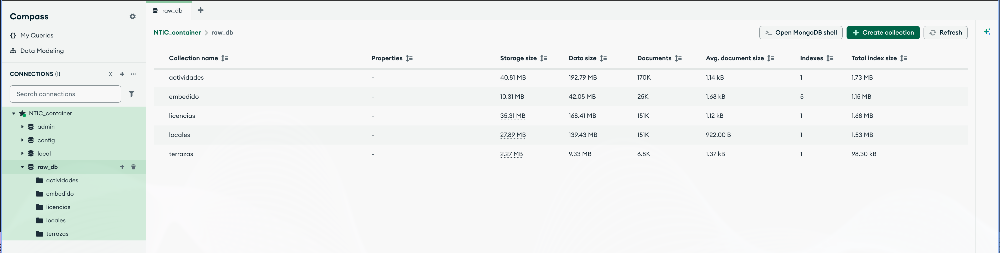

Con **25_000** documentos las diferencias de tiempo de ejecución no son muy notables, pero es posible analizar el resto de parámetros para evaluar de forma eficiente el resultado de la creación de los índices.

Todas las consultas se encuentran definidas en [mongo2.js](https://github.com/adecora/bbdd-nosql/blob/master/mongo2.js) y una vez la colección **embedido** está cargada en la base de datos **raw_db** [pueden ejecutarse como:](https://github.com/adecora/bbdd-nosql/blob/master/ejemplo2.gif)

```bash
$ docker cp mongo2.js mongo_ntic:/tmp
$ docker exec -it mongo_ntic mongosh /tmp/mongo2.js
```

**Índice compuesto**

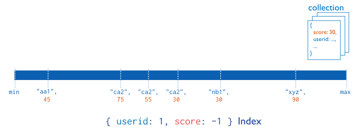

El primer índice que creamos en sobre al colección embedido es el índice compuesto `desc_distrito_local, desc_barrio_local`, primero ejecutamos una query sobre el campo de distrito sin índice para poder analizar el resultado.

```js
db.embedido
  .find({ desc_distrito_local: 'PUENTE DE VALLECAS' })
  .explain('executionStats');
```

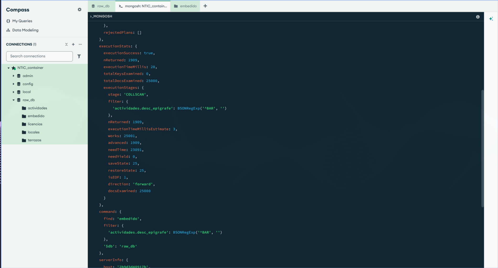

Para encontrar todos los distritos **"PUENTE DE VALLECAS"** MongoDB tiene que realizar un **COLLSCAN**, podemos observar como tiene que recorrer los **25_000** documentos para devolver los **1_781** que corresponden a **"PUENTE DE VALLECAS"**.

Ahora creamos el índice y ejecutamos la misma query.

```js
// Creamos el índice compuesto distrito-barrio
db.embedido.createIndex(
  { desc_distrito_local: 1, desc_barrio_local: 1 },
  { name: 'index_distrito_barrio' }
);

db.embedido
  .find({ desc_distrito_local: 'PUENTE DE VALLECAS' })
  .explain('executionStats');
```

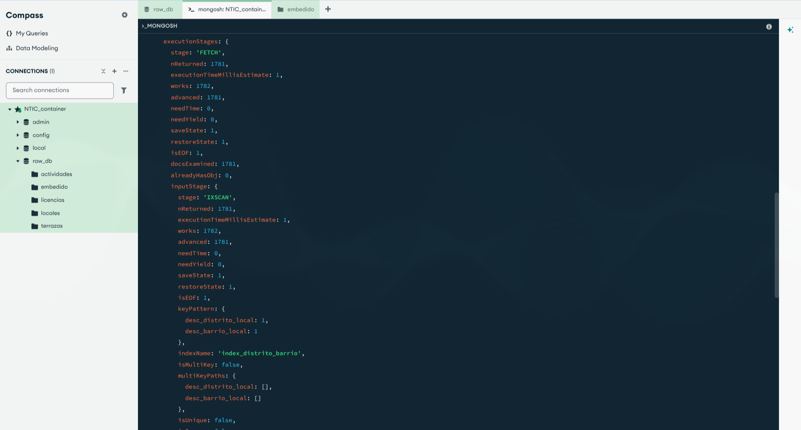

La ejecución cambia porque MongoDB puede usar el índice compuesto `{ desc_distrito_local: 1, desc_barrio_local: 1 }`. Al filtrar por `desc_distrito_local`, que es el primer campo del índice ahora usa **IXSCAN** para recorrer el rango de claves asociado a **"PUENTE DE VALLECAS"**. Este recorrido identifica los documentos candidatos **(1_781)**, sin tener que examinar la colección completa como en el caso anterior. Después, MongoDB ejecuta una fase **FETCH** para recuperar el documento completo asociado a cada entrada del índice, ya que la consulta necesita campos que no están contenidos únicamente en el índice.

Si la consulta sólo proyectara campos incluidos en el índice, entonces MongoDB puede omitir la fase **FETCH**.

Ahora para poner a prueba el índice compuesto lanzamos una query que ataque los dos campos.

```js
db.embedido
  .find({
    desc_distrito_local: 'PUENTE DE VALLECAS',
    desc_barrio_local: 'SAN DIEGO',
  })
  .explain('executionStats');
```


Como en el caso anterior, MongoDB puede utilizar el índice compuesto porque la consulta filtra por los dos campos que forman el índice: `desc_distrito_local` y `desc_barrio_local`. El plan de ejecución realiza un **IXSCAN** sobre el rango de claves que cumplen ambas condiciones y obtiene las entradas candidatas del índice sin recorrer toda la colección.

_¿Qué pasa si ahora lanzo una query contra `desc_barrio_local`, que también forma parte del índice compuesto?_

```js
db.embedido.find({ desc_barrio_local: 'SAN DIEGO' }).explain('executionStats');
```

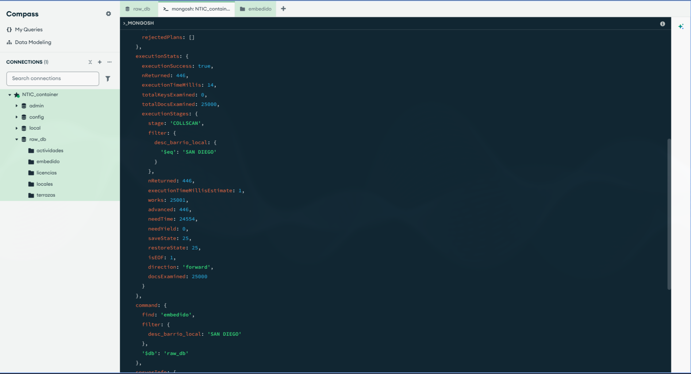

La consulta por `desc_barrio_local` no puede aprovechar ese índice compuesto como prefijo, porque omite el primer campo `(desc_distrito_local)`. Por eso MongoDB recurre a **COLLSCAN**. Para optimizar consultas frecuentes por barrio, tiene sentido crear un índice simple sobre `desc_barrio_local`.

**Índice simple**

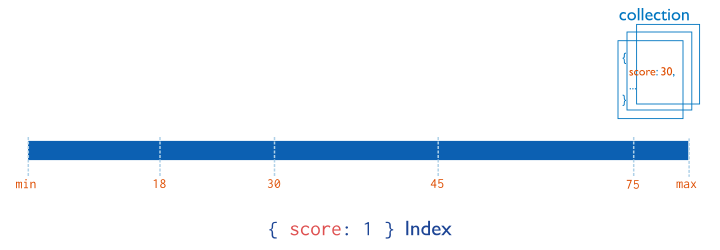

Creamos un índice simple sobre `desc_barrio_local` para optimizar las consultas por barrio.

```js
// Creamos el índice simple barrio
db.embedido.createIndex({ desc_barrio_local: 1 }, { name: 'index_barrio' });

db.embedido.find({ desc_barrio_local: 'SAN DIEGO' }).explain('executionStats');
```

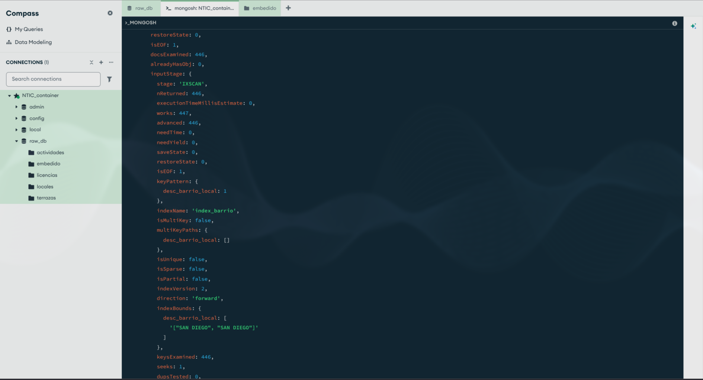

Ahora la query, sí realiza un **IXSCAN** y devuelve los el rango de claves que cumplen la condición **(446)** sin necesidad de analizar la colección completa.

**Índice multikey** [[7]](#ref7)

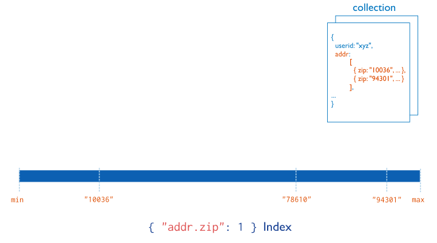

MongoDB permite crear índices en documentos embedidos dentro de arrays, en nuestra colección **embedido** los campos **licencias** y **actividades** cumplen está condición, en este caso el mejor candidato para crear un índice multikey es **actividades** ya que puede ser muy útil para hacer análisis poder consultar las **actividades** de los locales, mientras que las **licencias** son prácticamente exclusivas por local _(locales que comparten agrupación pueden compartir licencia)_.

El campo escogido para crear el índice multikey es `actividades.desc_epigrafe`, antes de crear el índice lanzamos la consulta de todos locales cuya actividad comienza por **BAR**.

```js
db.embedido
  .find({ 'actividades.desc_epigrafe': /^BAR/ })
  .explain('executionStats');
```


Comprobamos como MongoDB realiza un **COLLSCAN** y necesita escanear la colección completa.

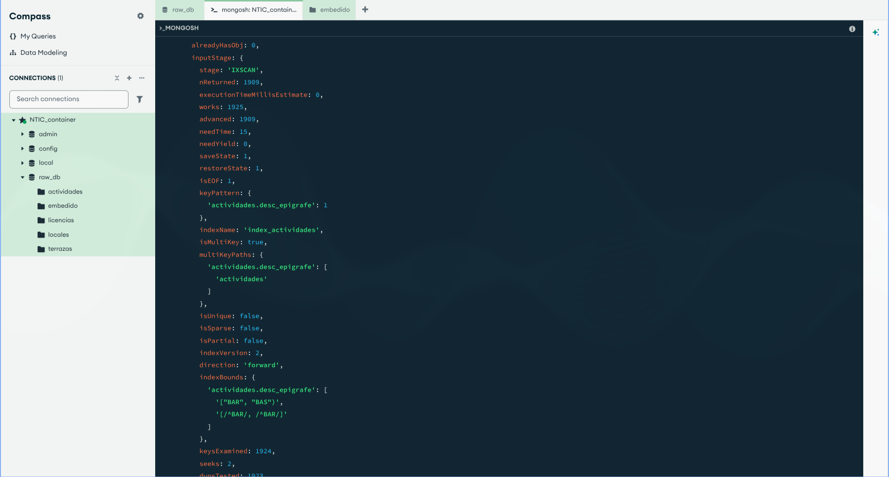

Ahora realiza un **"IXSCAN"** devuelve **1909** resultados y produce **15** iteraciones en las que leyó algo pero no devolvió resultado, esto se produce porque varias actividades del mismo local cumplen la condición `/^BAR/` y por tanto ese documento ya se retornó.

<div class="page-break"></div>

**Índice 2dsphere**

Creamos un índice 2dsphere sobre el campo `location` de la colección **embedido**.

```js
db.embedido.createIndex({ location: '2dsphere' }, { name: 'index_geospatial' });

db.embedido
  .find({
    location: {
      $near: {
        $geometry: {
          type: 'Point',
          coordinates: [-3.669101623781085, 40.395691671374856],
        },
        $maxDistance: 1000,
      },
    },
  })
  .explain('executionStats');
```

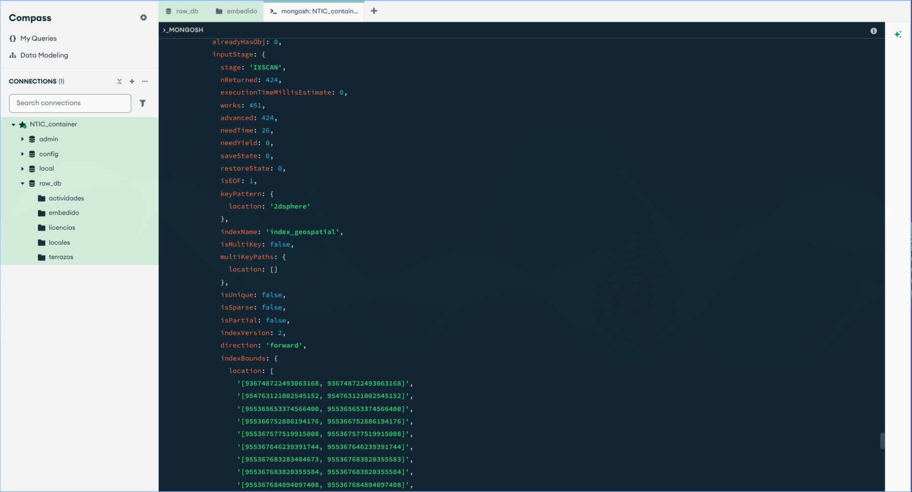

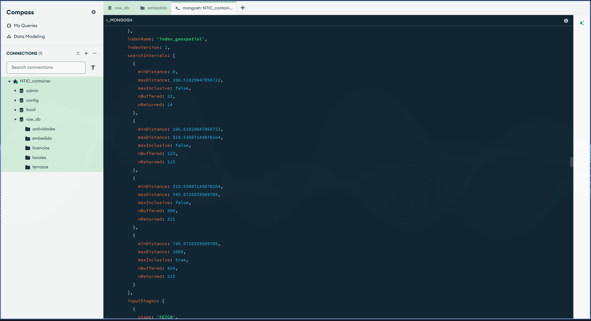

MongoDB devuelve **424** documentos y además realiza **26** pasos internos donde no devuelve nada. MongoDB divide la búsqueda por intervalos de distancia, para cada intervalo podemos visualizar los punto candidatos **nBuffered** y los puntos devueltos **nReturned**.

El índice geográfico permite ejecutar como el `top 3 de bares más cercanos a mi casa`.

```js
db.embedido
  .aggregate([
    {
      $geoNear: {
        near: {
          type: 'Point',
          coordinates: [-3.669101623781085, 40.395691671374856],
        },
        distanceField: 'distance',
        maxDistance: 200,
        spherical: true,
        key: 'location',
      },
    },
    { $match: { 'actividades.desc_epigrafe': /^BAR/ } },
    {
      $project: {
        _id: 0,

        desc_distrito_local: 1,
        desc_barrio_local: 1,

        direccion_acceso: {
          $concat: ['$clase_vial_acceso', ' ', '$desc_vial_acceso'],
        },
        rotulo: 1,
        total_licencias: {
          $size: {
            $ifNull: ['$licencias', []],
          },
        },

        ref_licencias: {
          $map: {
            input: { $ifNull: ['$licencias', []] },
            as: 'lic',
            in: '$$lic.ref_licencia',
          },
        },

        total_actividades: {
          $size: {
            $ifNull: ['$actividades', []],
          },
        },

        desc_epigrafes: {
          $map: {
            input: { $ifNull: ['$actividades', []] },
            as: 'act',
            in: '$$act.desc_epigrafe',
          },
        },

        tiene_terraza: {
          $and: [
            { $ne: [{ $type: '$terraza' }, 'missing'] },
            { $ne: ['$terraza', null] },
          ],
        },

        location: 1,
        distance: 1,
      },
    },
    { $sort: { distance: 1 } },
    { $limit: 3 },
  ])
  .forEach(printjson);
```

<div class="page-break"></div>

## Reto 3: Modelo de grafo

Para diseñar la base de datos para Neo4j, se utilizan como base la propuesta en el enunciado:

1. Nodos y atributos:
   - **Local** _{zona, direccion, nombre, tipo_actividad, horario, ref_licencia, desc_tipo_licencia, desc_tipo_situacion_licencia, location}_
   - **Terraza** _{zona, direccion, nombre, capacidad, rango_capacidad, periodo_terraza, estado_terraza, location}_
   - **Alojamiento** _{nombre, precio, numero_habitaciones, reseñas, servicios, tipo_habitacion, rango_precio, location}_
   - **Barrio** _{nombre, location}_

2. Relaciones y sus atributos:
   - **Ubicado_en** conecta _Local, Terraza y Alojamiento con su Barrio_. Atributo: **distancia**.
   - **Cercano_a:** conecta _Local, Terraza y Alojamiento_ entre sí, si están en un UMBRAL definido, 500m.
   - **Relacionado_con:** conecta los nodos principales de la misma categoría _(Local, Terraza, o Alojamiento)_ con un nodo puente (Hub) que centraliza sus atributos comunes [[8]](#ref8). La relación guarda la propiedad **motivo** y se distribuye así:
     - **Local**: los locales se conectan a un nuevo nodo _Actividad_ por su tipo de actividad.
     - **Terrazas**: las terrazas se conectan a un nuevo nodo _RangoCapacidad_ por su aforo.
     - **Alojamiento**: los alojamientos se conectan a un nuevo nodo _RangoPrecio_ por su tarifa.

### Creación de la base de datos

Para crear la base de datos en Neo4j se genera en Python una lista de entidades de forma aleatoria y se parsean para crear el script de Cypher, [barrios_grafo.cypher.](https://drive.google.com/file/d/1CfSlpv3hFoROuVtyKoCG9-OApHuDiWoI/view?usp=drive_link)

El primer paso es leer el fichero de [airbnb_listings.json](https://www.google.com/url?q=https%3A%2F%2Fdrive.google.com%2Ffile%2Fd%2F1l5nmgGeYnS7tGhzw0MN3Usg7yT-MEn92%2Fview%3Fusp%3Dsharing) y normalizarlo para que a la hora de crear las entidades los campos tengan el mismo formato que el de los ficheros de licencias, terrazas, locales y actividades que hemos transformado previamente.

Tras la normalización los nombres de los distritos `neighbourhood_group_cleansed` pasan a tener el mismo formato que en el resto de los ficheros, p.ej. `"Moncloa - Aravaca" -> "MONCLOA-ARAVACA"`.

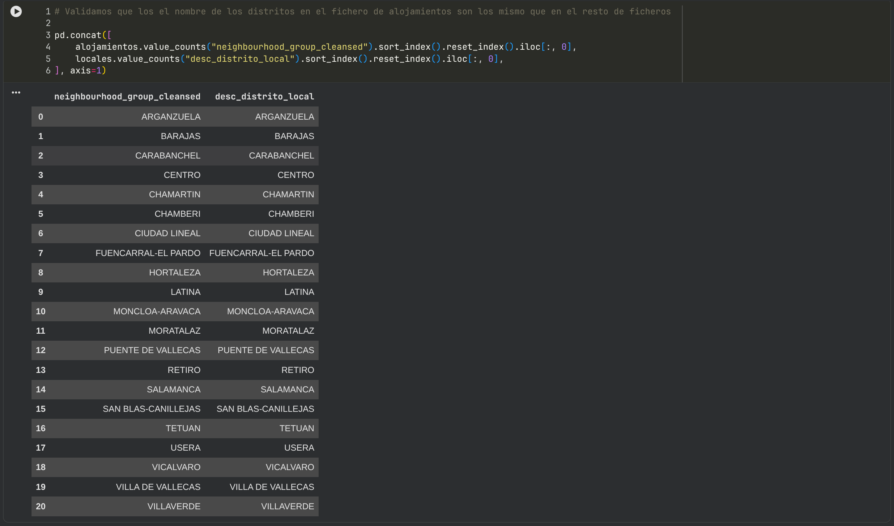

Para crear las relaciones entre alojamientos y entre terrazas utilizaremos dos campos generados, que no existen en los datasets originales. Para los alojamientos utilizamos **rango_precios** y para las terrazas **rango_capacidad**, estos campos contienen varios outliers y es necesario filtrarlos. Generamos los rangos filtrando por debajo del **percentil 95**.

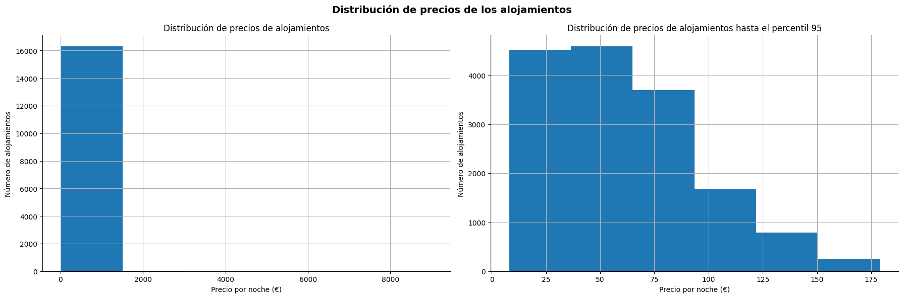

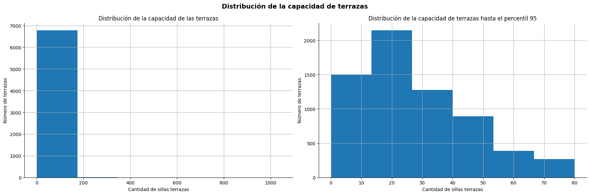

Se realiza un primer paso donde se prepara cada dataframe para convertirlo a una lista de entidades, este paso incluye _renombrar columnas, generar columnas nuevas y filtrar las columnas_.

Tras este paso he escogido cinco barrios `["SALAMANCA", "PUENTE DE VALLECAS", "ARGANZUELA", "CHAMBERI", "RETIRO"]` y se utiliza una función que muestrea de forma aleatoria 5 locales, 5 terrazas y 5 alojamientos pertenecientes a cada barrio. Para que modelo en Neo4j sea más sencillo de montar y más representativo la función que muestrea los datos elimina los nodos con valores `NA` y omite nombres de nodos son poco representativos o muy genéricos.

Para calcular la latitud y longitud de los barrios se agrupan por barrio todas las coordenadas de latitud y longitud disponibles en los dataframes de locales, terrazas y alojamientos y se realiza la media, esto nos permite aproximar el centroide de cada barrio [[9]](#ref9).

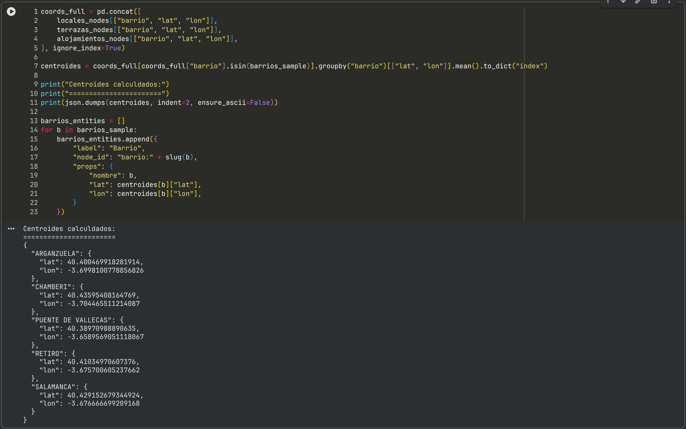

Finalmente generamos una lista de entidades que serán parseadas a un cypher para generar la base de datos.

```json
[
  {'label': 'Barrio',
  'node_id': 'barrio:salamanca',
  'lat': 40.429152679344924,
  'lon': -3.676666699209168
  'props': {'nombre': 'SALAMANCA'}},
 {'label': 'Local',
  'node_id': 'local:270126344',
  'barrio_id': 'barrio:chamberi',
  'barrio_grafo': 'CHAMBERI',
  'lat': 40.43926256125945,
  'lon': -3.7137597682792394,
  'props': {'zona': 'VALLEHERMOSO',
   'direccion': 'CALLE CEA BERMUDEZ',
   'nombre': 'JMM-JOSE MARTINEZ MEDINA',
   'tipo_actividad': 'COMERCIO AL POR MENOR DE MUEBLES',
   'horario': 'DESCONOCIDO',
   'ref_licencia': '500/2018/12418',
   'desc_tipo_licencia': 'DECLARACION RESPONSABLE',
   'desc_tipo_situacion_licencia': 'CONCEDIDA',
  'relacion_attr': 'COMERCIO AL POR MENOR DE MUEBLES'},
  ...
```

Primero se crean **constraints** por el campo definido como **node_id** que es la combinación del nombre del nodo en lowercase con el id único de cada dataframe, p.ej `df["node_id"] = "local:" + df["id_local"].astype(str)`. El valor calculado **node_id** se almancena en la propiedad **id** de cada nodo.

```cypher
CREATE CONSTRAINT barrio_id IF NOT EXISTS FOR (n:Barrio) REQUIRE n.id IS UNIQUE;
CREATE CONSTRAINT local_id IF NOT EXISTS FOR (n:Local) REQUIRE n.id IS UNIQUE;
CREATE CONSTRAINT terraza_id IF NOT EXISTS FOR (n:Terraza) REQUIRE n.id IS UNIQUE;
CREATE CONSTRAINT alojamiento_id IF NOT EXISTS FOR (n:Alojamiento) REQUIRE n.id IS UNIQUE;

// Indices para los nodos puente
// =======================================
CREATE CONSTRAINT actividad_id IF NOT EXISTS FOR (n:Actividad) REQUIRE n.id IS UNIQUE;
CREATE CONSTRAINT rangocapacidad_id IF NOT EXISTS FOR (n:RangoCapacidad) REQUIRE n.id IS UNIQUE;
CREATE CONSTRAINT rangoprecio_id IF NOT EXISTS FOR (n:RangoPrecio) REQUIRE n.id IS UNIQUE;
```

**Nodos**

```python
def merge_node(label, node_id, props, lat=None, lon=None):
    """
    Función auxiliar, MERGE de nodo por id y actualización de propiedades.
    """
    props = {k: v for k, v in props.items() if not is_null(v)}

    cypher_query = (
        f"MERGE (n:{label} {{id: {cypher_value(node_id)}}})\n"
        "SET n += " + cypher_map(props)
    )


    if lat is not None and lon is not None:
        cypher_query += f", n.location = point({{latitude: {lat}, longitude: {lon}}})"

    return cypher_query + ";"

print(merge_node(e["label"], e["node_id"], e["props"], e["lat"], e["lon"]))
# MERGE (n:Barrio {id: "barrio:salamanca"})
# SET n += {nombre: "SALAMANCA"}, n.location = point({latitude: 40.429152679344924, longitude: -3.676666699209168});
```

Se recorre toda la lista de entidades y generan los nodos con `merge_node` que genera el código Cypher para cada nodo:

```cypher
MERGE (n:Barrio {id: "barrio:salamanca"})
SET n += {nombre: "SALAMANCA"}, n.location = point({latitude: 40.429152679344924, longitude: -3.676666699209168});
```

Si existe un Barrio con `id = "barrio:salamanca"`, lo actualiza. Si no existe, lo crea y luego añade la propiedades del nodo, entre las propiedades del nodo incluimos un objeto de tipo `point` para representar las coordenadas espaciales.

**Relaciones Ubicado_en**

```python
def merge_rel(from_label, from_id, rel_type, to_label, to_id, props=None):
    """
    Función auxiliar, MERGE de relación entre dos nodos existentes.
    """
    props = props or {}

    cypher_query = f'MATCH (a:{from_label} {{id: {cypher_value(from_id)}}}), (b:{to_label} {{id: {cypher_value(to_id)}}})\n'

    if rel_type == 'Cercano_a':
        return (
            f'{cypher_query}'
            f'WHERE point.distance(a.location, b.location) <= {umbral_cercania}\n'
            f'MERGE (a)-[r:{rel_type}]->(b)\n'
            'SET r.distancia = round(point.distance(a.location, b.location));'
        )
    elif rel_type == 'Ubicado_en':
        return (
            f'{cypher_query}'
            f'MERGE (a)-[r:{rel_type}]->(b)\n'
            f'SET r.distancia = round(point.distance(a.location, b.location), 2);'
        )
    else:
        # Resto de realciones (ej: Relacionado_con)
        return (
            f'{cypher_query}'
            f'MERGE (a)-[r:{rel_type}]->(b)\n'
            f'SET r += {cypher_map(props)};'
        )

print(merge_rel(
        e["label"],
        e["node_id"],
        "Ubicado_en",
        "Barrio",
        e["barrio_id"],
    ))
# MATCH (a:Local {id: "local:270126344"}), (b:Barrio {id: "barrio:chamberi"})
# MERGE (a)-[r:Ubicado_en]->(b)
# SET r.distancia = round(point.distance(a.location, b.location), 2);
```

Para el cálculo de la relaciones de **Ubicado_en** se recorre cada _Local, Terraza, y Alojamiento_ generando la relación con el _Barrio_ al que pertenecen y calculando la distancia haciendo uso de la función `point.distance` de Neo4j. [[10]](#ref10)

Cada nodo genera:

```cypher
MATCH (a:Local {id: "local:270126344"}), (b:Barrio {id: "barrio:chamberi"})
MERGE (a)-[r:Ubicado_en]->(b)
SET r.distancia = round(point.distance(a.location, b.location), 2);
```

Busca el Local y el Barrio con los id's indicados y crea la relación **Local -> Barrio** si no existe, si ya existe la reutiliza y actualiza los atributos de la relación.

**Relaciones Cercano_a**

En el caso de **Cercano_a** recorremos toda la combinación de pares de entidades, este método es aceptable para una muestra pequeña. La distancia se calcula dentro de Neo4j con la función `point.distance` y en el caso que sea menor que 500m, el umbral que hemos establecido, recupera o crea la relación entre los pares y actualiza el atributo de distancia.

```cypher
MATCH (a:Local {id: "local:270126344"}), (b:Local {id: "local:280017283"})
WHERE point.distance(a.location, b.location) <= 500
MERGE (a)-[r:Cercano_a]->(b)
SET r.distancia = round(point.distance(a.location, b.location));
```

**Relaciones Relacionado_con**

Cada tipo de nodo está relacionado por un atributo diferente.

```python
rel_specs = {
    "Local": ("tipo_actividad", "Actividad", "tipo de actividad"),
    "Terraza": ("rango_capacidad", "RangoCapacidad", "capacidad de terraza"),
    "Alojamiento": ("rango_precio", "RangoPrecio", "rango de precio"),
}
```

```cypher
MERGE (n:Actividad {id: "actividad:comercio_al_por_menor_de_muebles"})
SET n += {valor: "COMERCIO AL POR MENOR DE MUEBLES"};
MATCH (a:Local {id: "local:270126344"}), (b:Actividad {id: "actividad:comercio_al_por_menor_de_muebles"})
MERGE (a)-[r:Relacionado_con]->(b)
SET r += {motivo: "Mismo tipo de actividad: COMERCIO AL POR MENOR DE MUEBLES"};

```

Se recorren todas las entidades y, si la entidad contiene un valor válido para el atributo de relación, el proceso se divide en dos pasos: primero se crea o recupera el nodo puente con MERGE y luego se conecta el nodo principal con dicho nodo puente mediante la relación **Relacionado_con**, especificando el motivo exacto en las propiedades de la relación.

El código completo [barrios_grafo.cypher](https://drive.google.com/file/d/1CfSlpv3hFoROuVtyKoCG9-OApHuDiWoI/view?usp=drive_link) está disponible para que pueda ser cargado en Neo4j y generar la base de datos.

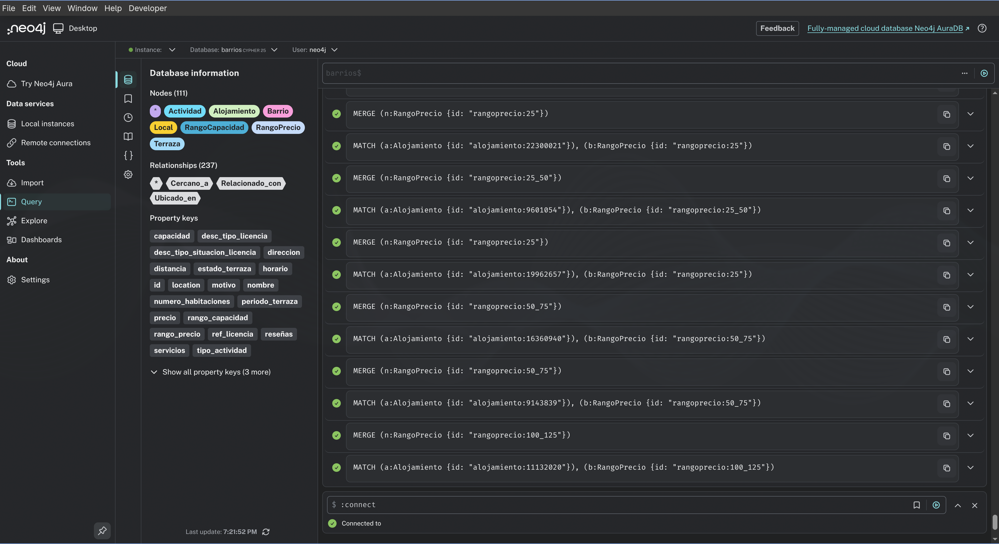

### Consultas sobre el grafo

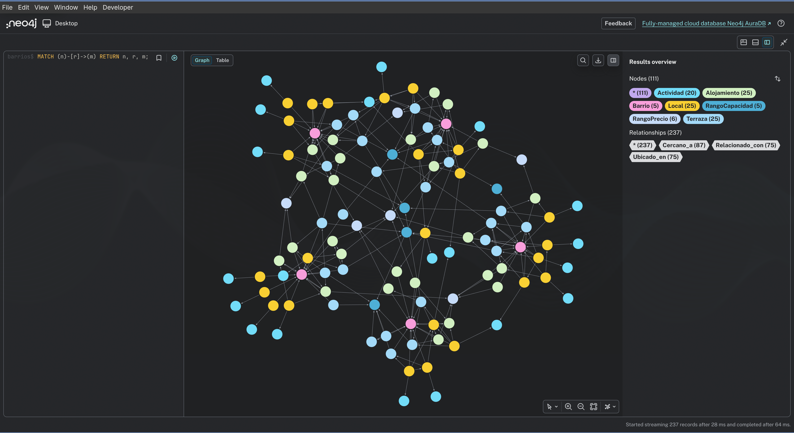

**Consulta1**

```cypher
MATCH (b:Barrio {nombre: "SALAMANCA"})<-[:Ubicado_en]-(n)
WHERE n:Local OR n:Terraza
RETURN n.nombre AS nombre, labels(n) AS tipo
```

Busca los nodos _Local o Terraza_ ubicados en el _Barrio_ "SALAMANCA" y devuelve el nombre y el tipo de nodo.

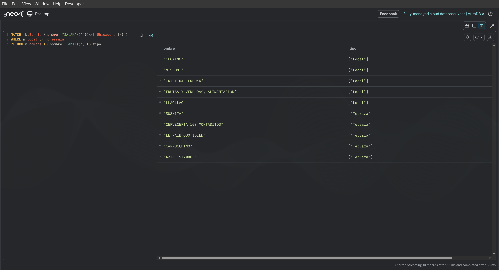

**Consulta2**

```cypher
MATCH (a:Alojamiento)
WHERE a.precio > 100
RETURN a.nombre AS nombre, a.precio AS precio
```

Extrae el nombre y el precio de todos los _Alojamientos_ que superen los 100€.

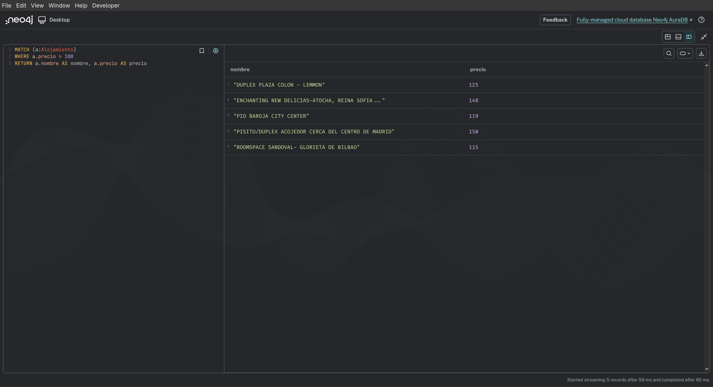

<div class="page-break"></div>

**Consulta3**

```cypher
MATCH (a:Alojamiento)-[:Ubicado_en]->(b:Barrio)
WHERE a.numero_habitaciones = 0
RETURN b.nombre AS barrio, COUNT(a) AS total_alojamientos
```

Busca todos los nodos de tipo _Alojamiento_ relacionadas con un nodo _Barrio_ por la relación **Ubicado_en**, después filtra aquellos que alojamientos que tengan 0 habitaciones y finalmente agrupa los resultados por barrio y hace un conteo de los alojamientos de ese tipo en cada barrio.

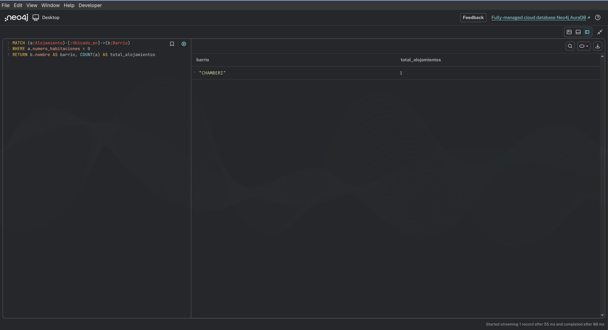

**Consulta4**

```cypher
MATCH (a:Alojamiento)-[:Ubicado_en]->(b:Barrio)
WHERE a.reseñas = 0
RETURN b.nombre AS barrio, COUNT(a) AS total_alojamientos
```

Busca todos los nodos de tipo _Alojamiento_ relacionadas con un nodo _Barrio_ por la relación **Ubicado_en**, después filtra aquellos que alojamientos que tengan 0 reseñas y finalmente agrupa los resultados por barrio y hace un conteo de los alojamientos de ese tipo en cada barrio.

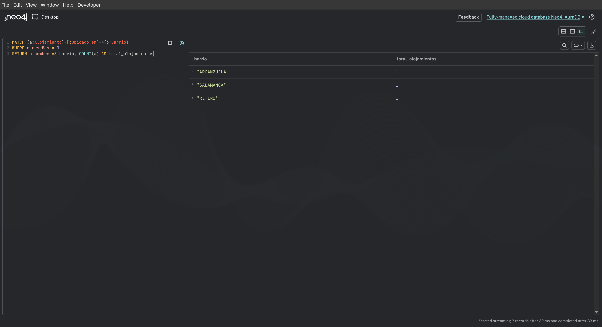

**Otras consultas posibles**

Otras consultas que podemos lanzar para extraer información relevante de nuestra base de datos, por ejemplo:

- _Estamos pensando en alojarnos en Puente de Vallecas y queremos un sitio que tenga ambiente cerca._ Buscamos todos los alojamiento ubicados en Puente de Vallecas y para esos alojamiento todos los nodos cercanos que sean locales o terrazas.

  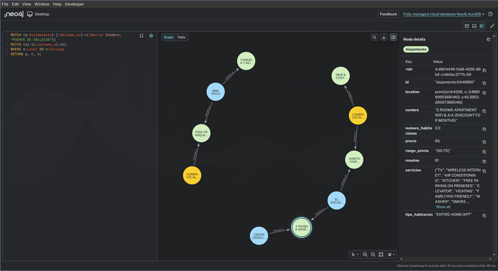

  Sobre nuestros datos de muestra **nombre: "2 ROOMS APARTMENT WIFI & A/A (DISCOUNT FOR MONTHS)"**, es la mejor opción con dos terrazas cercanas.

- _Queremos comprobar donde están ubicados los alojamientos más baratos_. Buscamos los nodos de tipo _Alojamiento_ asociados a los nodos _RangoPrecio_ más bajos para comprobar en qué barrios se encuentran. Después, buscamos los nodos _Barrio_ en el que está ubicado cada alojamiento mediante la relación **Ubicado_en**.

  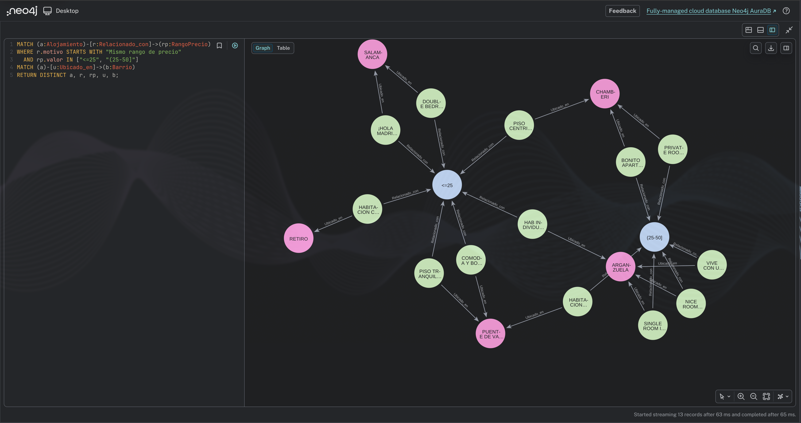

  Puente de Vallecas tiene los alojamientos más baratos en la muestra de datos analizada.

- _Estamos buscando una terraza grande para organizar un after-hours con los compañeros del trabajo_. Buscamos los nodos _Terraza_ grandes, es decir, terrazas asociadas a los nodos _RangosCapacidad_ más altos. Después recuperamos los nodos _Barrio_ en el que está ubicada cada terraza medianle la relación **Ubicado_en**.

  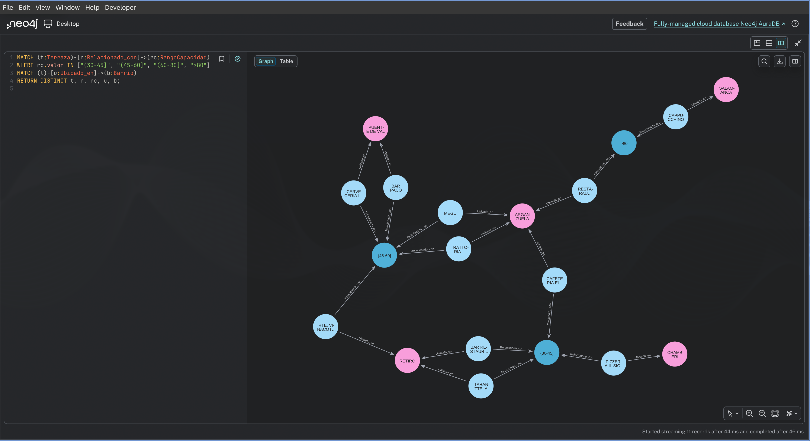

  Parece que la mejor opción es Arganzuela.

<div class="page-break"></div>

## Referencias y Bibliografía

<div class="references">

<a id="ref1">[1]</a> Acceso a la descarga directa de los ficheros alojados en [Google Drive a través de la URL `https://docs.google.com/uc?id=FILE_ID`](https://www.google.com/url?q=https%3A%2F%2Fstackoverflow.com%2Fquestions%2F41980082%2Fdownload-public-google-drive-files).

<a id="ref2">[2]</a> [Convención de nomenclatura](https://es.wikipedia.org/wiki/Snake_case) en la que cada espacio se reemplaza por guión bajo \_ y las palabras se escriben en minúsculas.

<a id="ref3">[3]</a> [Valores fuera del rango normal de los datos para representar la ausencia de valor](https://en.wikipedia.org/wiki/Sentinel_value).

<a id="ref4">[4]</a> [Formas normalizadas para la cadena Unicode, los valores válidos con "NFC", "NFKC", "NFD" y "NFKD".](https://docs.python.org/es/3/library/unicodedata.html#unicodedata.normalize)

<a id="ref5">[5]</a> Para la conversión se asume ETRS89/UTM zona 30N [(EPSG:25830)](https://epsg.io/25830) para las coordenadas de origen.

<a id="ref6">[6]</a> Optimización en un pipeline con **sorts** y **groups** por el mismo campo para usar [**$first** y **$last** en las fase de **$group**](https://www.mongodb.com/docs/manual/reference/operator/aggregation/group/#optimization-to-return-the-first-or-last-document-of-each-group).

<a id="ref7">[7]</a> [Puedes crear índices en campos de documentos embedidos dentro de arrays.](https://www.mongodb.com/docs/manual/core/indexes/index-types/index-multikey/create-multikey-index-embedded/).

<a id="ref8">[8]</a> Se usan nodos puente para evitar conectar todos los nodos entre sí y reducir la densidad innecesaria del grafo que puede generar un [anti-patrón "hairball".](https://medium.com/neo4j/graph-modeling-all-about-super-nodes-d6ad7e11015b)

<a id="ref9">[9]</a> El centroide de cada barrio se aproxima mediante la media de coordenadas disponibles. No representa el centroide administrativo oficial, sino un centro aproximado de los datos observados.

<a id="ref10">[10]</a> La [función espacial `point distance`](https://neo4j.com/docs/cypher-manual/current/functions/spatial/#functions-distance) nos permite obtener la distancia entre dos puntos en metros.

</div>
